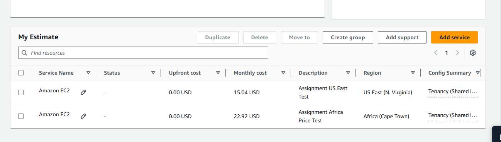
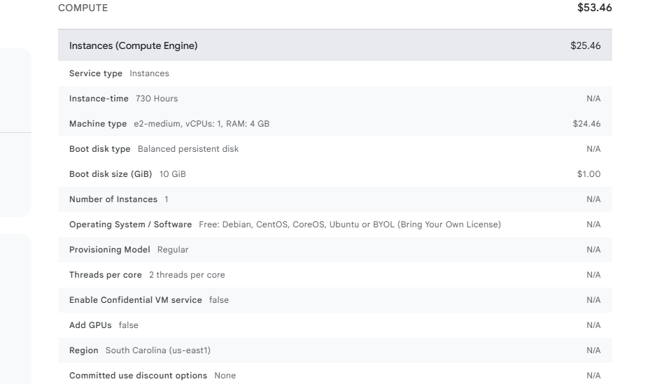
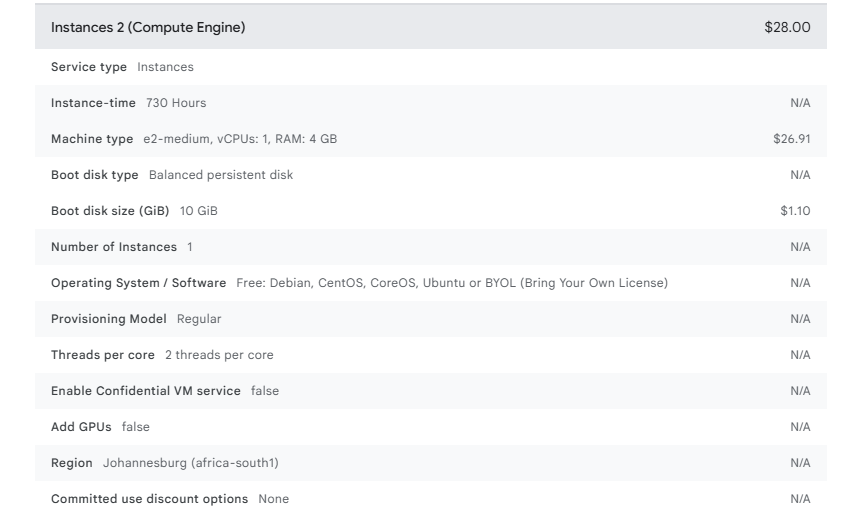
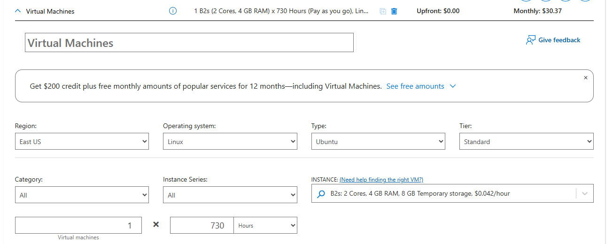
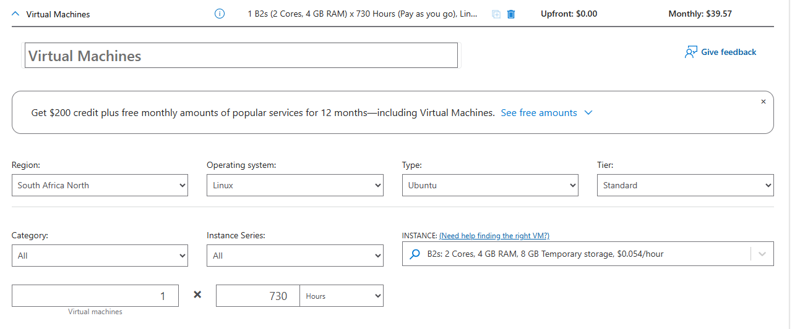

# Cloud Computing Basics: Pricing Comparison

## Project Overview
This project explores the fundamentals of cloud computing by comparing the pricing of Virtual Machine (VM) services across three major cloud providers: **Amazon Web Services (AWS)**, **Google Cloud Platform (GCP)** and **Microsoft Azure**.

The pricing calculators from each provider were used to estimate the cost of running virtual machines in different geographic regions. The goal was to understand how cloud pricing varies across regions and how this affects infrastructure planning.

---

## Technical Configuration
To ensure a fair comparison, the same specifications were used across all providers:
- **vCPU:** 2
- **RAM:** 4 GB
- **Operating System:** Linux (Ubuntu)
- **Provisioning Model:** Pay-as-you-go
- **Estimated Usage:** 730 hours per month (standard monthly estimate)

---

## Tools Used
The following official pricing calculators were used to estimate the monthly costs:
- AWS Pricing Calculator
- Google Cloud Pricing Calculator
- Microsoft Azure Pricing Calculator

---

## Pricing Comparison Table

| Cloud Provider | Instance Type | US Region Price | Africa Region Price |
| :--- | :--- | :--- | :--- |
| **AWS** | t3.medium | $15.04 | $22.92 |
| **GCP** | e2-medium | $25.46 | $28.00 |
| **Azure** | B2s | $30.37 | $39.57 |

---

## Steps Taken
1. **Accessed Pricing Calculators:** Navigated the official pricing calculators for AWS, Google Cloud and Azure.
2. **Configured Comparable Instances:** Selected comparable instance types (t3.medium, e2-medium and B2s) with similar compute and memory specifications.
3. **Selected Different Regions:** Compared the estimated cost of running the same configuration in a US region and an Africa region for each provider.
4. **Recorded Pricing Results:** Documented the estimated pricing results and captured screenshots from the calculators.

---

## Lessons Learned
1. **Regional Pricing Differences:** Cloud services in African regions such as Cape Town or Johannesburg tend to be more expensive than US regions due to infrastructure availability and operational costs.
2. **Provider Cost Variations:** Even with similar configurations, pricing differs across providers. In this comparison, AWS provided the lowest cost while Azure had the highest estimated cost.
3. **Importance of Pricing Calculators:** Cloud pricing calculators are useful tools for estimating infrastructure costs before deploying services.
4. **Cloud Cost Awareness:** Understanding pricing differences across regions is important for designing cost-efficient cloud infrastructure.

---

## Evidence of Pricing Comparison

### AWS Pricing Comparison

---

### Google Cloud Pricing Comparison

**US Region (South Carolina)**

**Africa Region (Johannesburg)**

---

### Microsoft Azure Pricing Comparison

**US Region (East US)**

**Africa Region (South Africa North)**

---

## Conclusion
This comparison demonstrates that cloud pricing varies depending on the provider and geographic region. Understanding these differences helps organizations and engineers make better decisions when planning cloud infrastructure.
